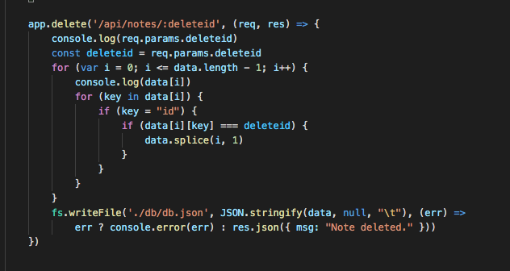

# NoteTaker
 
## Project Description
This application was created so a user could easily notes, view the notes, then delete the notes. 
 
## Table of Contents
- [Installation](#installation)
- [Criteria Checks](#criteria)
- [Usage and Coding](#Usage/coding)
- [Screenshots](#screenshots)
- [Questions](#questions)
- [Credits](#credits)
- [License](#license)
## Installation
Clone or download this repository on GitHub: https://github.com/edoliva/NoteTaker
Deployed test link: https://git.heroku.com/safe-falls-02568.git
## Criteria
- The user can enter their note information on the deployed link. If the need to view past notes or delete thet can use the icon buttons. 
## Usage/coding:
- This application was written to allow for a clean user experience. The general logic is as follows:
   - The reop contains a server.js file to get and post requests.
   - There is a route directory to handle the requests.
   - The public directory contains the CSS, HTML, and JS files provided at the start.

## Screenshots

Delete coding using For loop/If statement /ForIn loops. There was likley a more prefered option, but I wanted to practice these JS commands:

-

## Questions
Please direct any questions regarding this application to:
- GitHub username: edoliva
- GitHub profile link: https://github.com/edoliva
- Email address: edmond.oliva@gmail.com 

## Credits
Shoutout to our instructor Anthony and TA Tom! As well as everyone at Trilogy Education for making the content and grading our assignments.
 
## License
© 2021 Ed Oliva

Confidential and Proprietary. All Rights Reserved.

Permission is hereby granted, free of charge, to any person obtaining a copy of this software and associated documentation files (the "Software"), to deal in the Software without restriction, including without limitation the rights to use, copy, modify, merge, publish, distribute, sublicense, and/or sell copies of the Software, and to permit persons to whom the Software is furnished to do so, subject to the following conditions:

The above copyright notice and this permission notice shall be included in all copies or substantial portions of the Software.

THE SOFTWARE IS PROVIDED "AS IS", WITHOUT WARRANTY OF ANY KIND, EXPRESS OR IMPLIED, INCLUDING BUT NOT LIMITED TO THE WARRANTIES OF MERCHANTABILITY, FITNESS FOR A PARTICULAR PURPOSE AND NONINFRINGEMENT. IN NO EVENT SHALL THE AUTHORS OR COPYRIGHT HOLDERS BE LIABLE FOR ANY CLAIM, DAMAGES OR OTHER LIABILITY, WHETHER IN AN ACTION OF CONTRACT, TORT OR OTHERWISE, ARISING FROM, OUT OF OR IN CONNECTION WITH THE SOFTWARE OR THE USE OR OTHER DEALINGS IN THE SOFTWARE.
---
